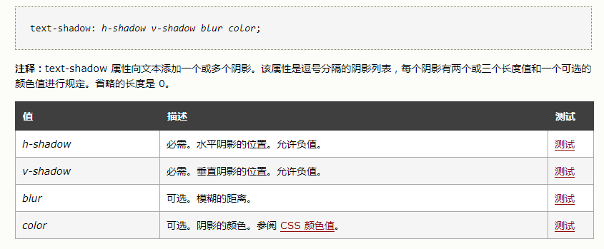

# h5新标签
* header
* nav
* section
* main
* aside
* aiticle
* caption
* audio
> <audio src='' controls autoplay loop>
* video
> <video src='' contrls autoplay loop>
1. controls 页面中显示
2. autoplay 自动播放
3. loop 循环播放
* footer
* address
* canvas
* i\/b\/big\/small

# css新特征
* word-wrap
* text-overflow
* text-decoration

* text-shadow

* gradient

# canvas

# less

# typeScript