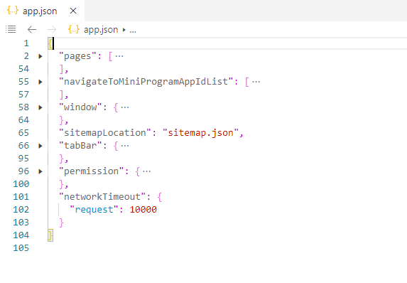
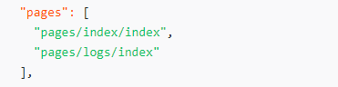
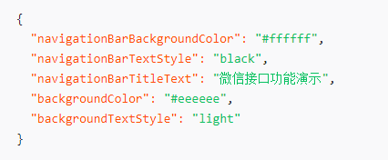
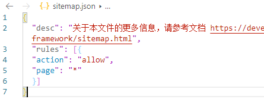
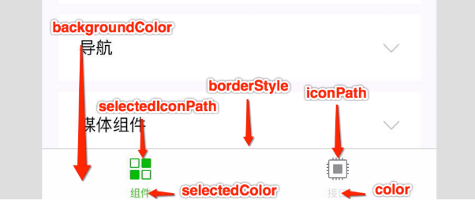
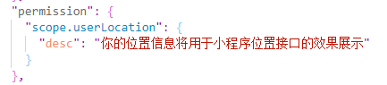
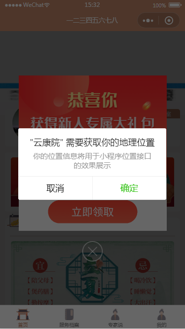
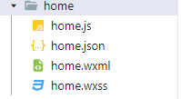

# 文件目录

> component 公共组件

> img 图片

> libs 插件，外部引入

> pages 页面

> utils 封装公共方法

> wxParse html转wxml-->插件

> app.js 公共逻辑方法

> app.json 公共配置

> app.wxss 公共样式

## app.json

* pages
> 用于指定小程序由哪些页面组成，每一项都对应一个页面的 路径（含文件名） 信息。
> 数组的第一项代表小程序的初始页面（首页）。

* navigateToMiniProgramAppIdList
> 跳转另一个小程序，最多十个

* window
> 全局窗口表现

|  属性   | 描述  |
|  ----  | ----  |
| navigationBarBackgroundColor  | 导航栏背景颜色  |
| navigationBarTextStyle  | 导航栏标题颜色，仅支持 black / white |
| navigationBarTitleText  | 导航栏标题文字内容	  |
| backgroundColor |  窗口的背景色 |
| enablePullDownRefresh  | 是否开启全局的下拉刷新  |

* sitemapLocation
> 引入sitemap.json。
> 开发者可以通过 sitemap.json 配置，或者管理后台页面收录开关来配置其小程序页面是否允许微信索引。

|  属性   |  取值  |  取值说明  |
|  ----   | ----  |  ----  |
| action  | "allow"、"disallow" |  命中该规则的页面是否能被索引  |
|  page  |  "*"、页面的路径   |  * 表示所有页面   |

* tabBar
> 底部tab表现，颜色仅支持16进制

|  属性   | 描述  |
|  ----  | ----  |
| color  | tab 上的文字默认颜色 |
| selectedColor  | tab 上的文字选中时的颜色 |
| backgroundColor  | tab 的背景色  |
| borderStyle |  tabbar 上边框的颜色，black / white |
| list  | tab 的列表，最少 2 个、最多 5 个 tab  |

> list：icon大小限制40kb,尺寸81*81

|  属性   | 说明  |
|  ----  | ----  |
| pagePath  | 页面路径，必须在 pages 中先定义 |
| text  | tab 上按钮文字 |
| iconPath  | 图片路径  |
| selectedIconPath |  选中时的图片路径 |

* permission

* netWorkTimeout
> 网络超时时间

## app.js
* 每个小程序都需要在 app.js 中调用 App 方法注册小程序实例，绑定生命周期回调函数、错误监听和页面不存在监听函数等。

## pages

* .wxml-->页面结构
> 组件

    view，text，swiper，scroll-view，input，CheckBox，button
    audio，video，map，block

> 数据绑定

    <view>{{data}}</view>

> 列表渲染

    <view wx:for="{{array}}"> {{item}} </view>

> 条件渲染

    <view wx:if="{{view == 'WEBVIEW'}}"> WEBVIEW </view>
    <view wx:elif="{{view == 'APP'}}"> APP </view>
    <view wx:else="{{view == 'MINA'}}"> MINA </view>

> 事件参数，大小写问题

    <view data-hi="WeChat" bindtap="tapName">Click me!</view>
>阻止冒泡事件

    <view id="outer" bindtap="handleTap1">
        outer view
        <view id="middle" catchtap="handleTap2">
            middle view
            <view id="inner" bindtap="handleTap3">
                inner view
            </view>
        </view>
    </view>

* .js----->页面逻辑
> getapp()

> 生命周期

    pages({
        data: {
            text: "This is page data."
        },
        onLoad: function(options) {
            console.log(options.id)
            // 页面创建时执行
            console.log('页面加载时触发。一个页面只会调用一次，可以在 onLoad 的参数中获取打开当前页面路径中的参数。)
        },
        onShow: function() {
            // 页面出现在前台时执行
            console.log('页面显示/切入前台时触发。)
        },
        onReady: function() {
            // 页面首次渲染完毕时执行
            console.log('页面初次渲染完成时触发。一个页面只会调用一次，代表页面已经准备妥当，可以和视图层进行交互。)
        },
        onHide: function() {
            // 页面从前台变为后台时执行
            console.log('页面隐藏/切入后台时触发)
        },
        onUnload: function() {
            // 页面销毁时执行
            console.log('页面卸载时触发。如wx.redirectTo或wx.navigateBack到其他页面时。)
        },
        onPullDownRefresh: function() {
            // 触发下拉刷新时执行
        },
        onReachBottom: function() {
            // 页面触底时执行
         },
        onShareAppMessage: function () {
                // 页面被用户分享时执行
        },
        onTabItemTap(item) {
                console.log(item)
        }
    })
> 点击事件对象

|属性|说明|
|-----|-----|
|type|事件类型|
|timeStamp|事件生成时的时间戳|
|target|触发事件的组件的一些属性值集合|
|currentTarget|当前组件的一些属性值集合|
> 请求方法

    wx.request({
        url: 'test.php', //仅为示例，并非真实的接口地址
        data: {
            x: '',
            y: ''
        },
        header: {
            'content-type': 'application/json' // 默认值
        },
        success: function(res) {
            console.log(res.data)
        },
        fail: function (err) {
            console.log(err)
        },
        complete: function(e) {
            console.log(e)
        }
    })
> 保存数据

    this.setData({
      text: 'Set some data for updating view.'
    }

> 页面通信

|属性|说明|
|-----|-----|
|  wx.switchTab(url:'/index')  |  跳转到 tabBar 页面  |
|  wx.navigateTo(url:'/login')  |  保留当前页面，跳转到应用内的某个页面。  |
|  wx.redirectTo(url:'/login?id=1')  |  关闭当前页面，跳转到应用内的某个页面。  |

* .json -->页面配置 ———— 非必需

|  属性   | 描述  |
|  ----  | ----  |
| navigationBarBackgroundColor  | 导航栏背景颜色  |
| navigationBarTextStyle  | 导航栏标题颜色，仅支持 black / white |
| navigationBarTitleText  | 导航栏标题文字内容	  |
| backgroundColor |  窗口的背景色 |
| enablePullDownRefresh  | 是否开启当前页面的下拉刷新  |
| usingComponents   |  页面自定义组件配置   |

* .wxss -->页面样式 ———— 非必需
> 单位 ：rpx

> 选择器

    .class	#id  element   伪类

> 样式
    
    <view class="normal_view" />
    .normal_view {
        padding:15px;
    }

> 内联样式

    <view style="color:red"></view>

## 组件
* button 

        <button disabled="" open-type="launchApp" hover-class=""></button>

    |属性|说明|
    |----|----|
    |disabled|是否禁用|
    |open-type|微信开放能力|
    |app-parameter|打开 APP 时，向 APP 传递的参数|
    |bindgetuserinfo|用户点击该按钮时，返回获取到的用户信息|
    |bindcontact|客服消息回调|
    |bindgetphonenumber|获取用户手机号回调|
    |bindlaunchapp|打开 APP 成功的回调|

> open-type合法值

|值|说明|
|---|---|
|contact|打开客服会话|
|share|触发用户转发|
|getPhoneNumber|获取用户手机号，可以从bindgetphonenumber回调中获取到用户信息|
|getUserInfo|获取用户信息，可以从bindgetuserinfo回调中获取到用户信息|
|launchApp|打开APP，可以通过app-parameter属性设定向APP传的参数|
|
