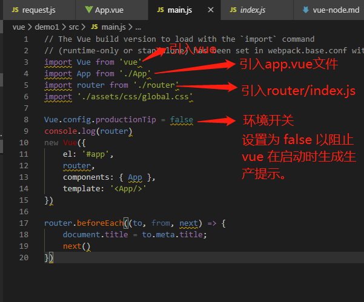

#### 安装
* 安装node

* 安装cli：npm install -g vue-cli

* 查看模板：vue list

* 安装：vue init webpack <name>

 * 进入项目：cd <name>

* 安装依赖：npm install

* dir查看目录，比之前多了一个node_modules

* 运行项目：npm run dev

# <table><tr><td bgcolor=AliceBlue color=#FAEBD7>Vue——回顾1</td></tr></table>
1. 安装node
2. 安装vue-----npm install vue
3. 安装vue-cli-----npm install -g vue-cli
4. 创建一个webpack模板的项目-----vue init webpack my-project

# Vue基础
#### 属性  
* v-bind ：name  || ：name
* v-on:name || @name
* v-for='item in arr' || v-for='(item index) in arr'
* v-if || v-show

#### 组件、父子组件传参
1. 父传子
* 父组件直接v-bind写入属性，子组件用props声明该属性  props:['xxx'] 就可以直接用了
* 父：this.push({name:'pathName',params:{a:a1}})；子:this.$route.params.a
2. 子传父
````
    // 父组件
    <emitChild @func="getMsgFormSon"></emitChild>
    import emitChild from "@/components/emitChild"
    data() {
        return {
            msgFormSon: "this is msg"
        };
    },
    methods: {
        getMsgFormSon(data){
            this.msgFormSon = data;
            console.log(this.msgFormSon) // 我是子组件的msg
        }
    }


    // 子组件
    <input @click="sendMsg" type="button" value="给父组件传递值">
    data () {
        return {
            msg: "我是子组件的msg",
        }
    },
    methods:{
        sendMsg(){
            // func: 是父组件指定的传数据绑定的函数
            // this.msg:子组件给父组件传递的数据
            this.$emit('func',this.msg)
        }
     }
````
3. 公共组件
    vue.component({'组件名',template:'<div></div>'})

#### filter过滤器
* 可局部用，也可设置全局，具体可百度（操作简单）
#### watch 监视
* v-model只是数据同步，watch可以数据触发事件 
* 简单监视:基本数据

       watch:{
        key:function(newV,oldV){

        }
       }

* 深度监视:object || array

       watch:{
           kay:{
            deep:true,
            handler:function(newV,oldV){

            }
           }
       }
#### computed监视多个，计算属性
* 凡是里边有的this值，值改变会引起computed方法

        computed:{
            fn:function(){

            }
        }

#### slot 传递DOM
* 留坑\<slot>\</slot>,父组件直接写DOM
* 无名
* 具名  标签加  slot='name'

#### 生命周期
> beforeCreate
* 组件创建之前
> created        
* 组件创建之后
* 可以操作数据，触发以上的事件函数
* 实现vue->页面的影响，发起ajax请求
> beforeMount
* vue起作用之前
> mouned
* vue起作用之后，发起ajax请求
> beforeUpdate
* 数据改变之前
> updated
* 数据改变之后
> activated
* 组件被激活
> deactivated
* 组件被停用3...
> beforeDestory
* v-if false 销毁之前
> destroyed
* 销毁之后

#### $ref 
* 指定DOM节点，获取DOM元素
* 在任意标签中写  ref="xxx"
* 通过组件this.$refs.xxx   获取元素
* this.$refs.xxx.$el  获取DOM  
* 改变DOM后   并对这个DOM操作

        this.show = true; //input显示出来并聚焦
        this.$nextTick(function(){
            this.$ref.input.focus();
        })

# router  
* 单页面  之前的跳转会重新渲染页面，单页面改变锚点不会重新渲染页面
* hashchange事件    锚点数据（#XXX）
* 根据不同的锚点值做不同的处理
* 用法：router提供自己的标签\<router-view>代替\<a>

        import login from '@/components/login/login'

        Vue.use(Router)

        routes:[
            {name:'login',path:'/mylogin',component:login}
        ]

        <router-link to='/login'>登录</router-link>
        <router-link :to="{ name='login' }">登录</router-link>
        
#### router-link属性
* to
* replace
* append
* tag
* active-class
* exact
* event
* exact-active-class
* aria-current-value
#### router传参
1. 查询字符串 query
    - 配置：:to="{ name:'login',query:{id:1} }"
    - 规则：{ name:'login',path:'/login',component:login }
    - 获取：this.$route.query.id
    - 生成：\<a href="/login?id=1"></a>
2. path方式
    - 配置：:to="{ name:login,params:{id:1} }"
    - 规则：{ name:login,path:'/login/id',component:login }
    - 获取：this.$route.params.id
    - 生成：\<a href="/login/1"></a>
> params传参要在路由中的path后写:  /:name 
> 接受参数都一样用  this.$route.query / this.$route.params  获取的均为参数对象

        <router-link :to="{ name='login',query:{id:1} }">登录</router-link>
        <router-link :to="{ name='index',params:{name:abc} }">登录</router-link>

         routes:[
            {name:'login',path:'/mylogin',component:login},
            {name:'index',path:'/index/:name',component:index}
        ]

#### 嵌套路由
1. router-view中包含router-view
2. 路由中中存在子路由
    
        route:[
            {name:'index',path:'/index',component:index},
            chilren:[
                {name:'index1',path:'/index1',compoment:index1}
            ]
        ]

#### meta  
* 给未来路由的权限规则
* router.beforeEach是全局路由守卫，每次路由都会调用，用来参照条件

        router:[
            {name:'login',
            path:'/login',
            component:login,
            meta:{
                ischeck:true
                }
            }
        ]  

        router.beforeEach((to, from, next) => {
            // to 旧路由
            // from 新路由
            // 带有参数，meta
            // next有：next(fasle),next('/path'),next({ name:'name' })
            next()
        })   


# axios
* 引入  import axios from 'axios'
#### get请求

        axios.get('/user?ID=12345')
            .then(function(response){
                console.log(response)
            })
            .catch(function (error) {
                console.log(error)
            });
            .then(function(){

            })
  })
#### 异步请求

        async function getUser() {
            try {
                const response = await axios.get(/user?id=1');
                console.log(response)
            } catch (error) {

            }
        }
#### post请求

        axios.post('/user',{id:1}),
            .then(function(response){
                console.log(response)
            })
            .catch(function(error){
                console.log(error)
            })

#### 常用法
1. 引入

        import axios from 'axios'

2. 配置baseURL

        axios.defaults.baseURL = 'http://baidu.com
        // 这里设置请求拦截器

3. 声明接口对象

        const serveHttp={
            getData:function(data){
                return axios.get('URL',data)
            }
        }
        export defaults.serveHttp

4. 页面调用

        import serveHttp from '@/api'
        created () {
            serveHttp
            .getData({param:'XXX'})
            .then(res => {
                console.log(res)
            })
        }

# demo:上传图片--取消上传--继续上传

        var CancelToken = axios.CancelToken;
        var source = CancelToken.source();
        axios.get('/user/12345', {
            cancelToken:source.toke
        }).catch(function(thrown){
            if(axiso.isCancel(thrown)){
                console.log('Rquest canceled', thrown.message);
            }else{
                //handle error
            }
        });

        //取消请求(信息参数设可设置的)
        source.cancel("操作被用户取消");
        var source = CancelToken.source();

        axios.get('/user/12345', {
            cancelToken:source.toke
        }).catch(function(thrown){
            if(axiso.isCancel(thrown)){
                console.log('Rquest canceled', thrown.message);
            }else{
                //handle error
            }
        });

        //取消请求(信息参数设可设置的)
        source.cancel("操作被用户取消");

> 这里箭头函数可以省去this指向问题

> get和post方式一样，关键字改下即可

> axios可以设置拦截器，设置请求loading

# Vue---demo
#### main.js是主要文件   串联整个vue


#### 双向绑定原理:defineProperty

        let obj = { a: 1 }
        let newValue = 45

        Object.defineProperty(obj, 'a', {
            get(value) {
                console.log(value)
                return value
            },
            set(newValue) {
                console.log(newValue)
                value = newValue
            }
        })
        obj.b = 6 //设置 触发set方法

        obj.a = 5//获取 触发get方法

# 项目 - 新闻 newList

* 图片引入  require('')
* axios 请求数据
* $nextTick渲染后操作
* headler:{},deep:true深度检测
* navBar全局返回button组件
* v-html   scoped局部样式不起作用，可以写在全局样式
* vue-preview  图片插件

* 路由传参
* 组件传参

 > mint-ui : npm install mint-ui -S
 
 > moment.js: npm install moment --S

# Vue——二次回顾

##### 嵌套路由
* 场景：选项卡、tab页面切换
* 写法：在tab中写router-view，路由配置如下
* 理解：点击选项卡，对应的子路由会将内容渲染在tab中的router-view
````
    [{
        path:'tab',
        component:tab,
        children:[{
            path:'index',
            component:index
        },
        {
            path:'user',
            component:user
        }]
    }]

    // 模板文件 
    <div>
        <router-view></router-view>
        <div>
            <router-link to='/index'>
                首页
            </router-link>
            <router-link to='/user'>
                我的
            </router-link>
        </div>
    </div>

````
##### 页面跳转及传参
* 跳转分两类

1. 不带参
````
    <router-link to='pathName'></router-link>
    <router-link :to="{ name: 'nameName'}">
    this.$router.push('pathName');
    this.$router.push({ path:'pathName' })
    this.$router.push({ name:'name' })
````
2. 带参数
````
    模板写法：<router-link :to='{ name:home,query:{id:'123'} }'></router-link>
    事件写法：this.route.push({name:'home',query:{id:123}})
    路由配置：{path:'home,name: home,component:home}
    获取方式：this.$route.query.id


    模板写法：<router-link :to='{ name:"home",parmas:{id:'123'} }'></router-link>
             <router-link to='home/123'></router-link>
    事件写法：this.$router.push({ name:home,params:{id:123}})
    路由配置：{path:'home/id',name:home,component:home}
    获取方式：this.$route.params.id
    
````
> 总结
    1. 不带参数直接写就可以了，用name或者path需要给to加':';
    2. 带参数主要两种params和query;
    3. params只能用name，用path会undefind，路由需要设置:id/:name,地址栏生成path/id/name;
    4. query可以用name和path，路由无需设置，地址栏生成?id=&name=;

#### 重定向redirect
#### 导航守卫
* 前置守卫：进入一个页面前处理逻辑
````
    router.beforeEach((to, from, next) => {
        if (to.name !== 'Login' && isAuthenticated) next({ name: 'Login' })
        // 如果用户未能验证身份，则 `next` 会被调用两次
        next()
    })
````
* 后置逻辑：进入后再处理逻辑
````
    router.afterEach((to, from) => {
        // ...
    })
````
* 私有守卫：直接在路由后边写
````
    routes: [
    {
      path: '/foo',
      component: Foo,
      beforeEnter: (to, from, next) => {
        // ...
      }
    }
  ]
````
* 组件内守卫：待研究
#### 路由元
* meta
#### 路由组件传参
* 使用 props 将组件和路由解耦：取代与 $route 的耦合
* 个人理解：组件化开发中需要一些组件，直接用props传参就很方便，不用地址栏写很多参数
* 传参地方不变，路由写为：{path："index/:id",component:index,props:rue};接收那个定义props:['id'];query传参未研究明白
#### 过渡元素
````
    const Foo = {
        template: `
            <transition name="slide">
                <div class="foo">...</div>
            </transition>
        `
    }

    const Bar = {
        template: `
            <transition name="fade">
                <div class="bar">...</div>
            </transition>
        `
    }
````
#### 获取数据----loading
#### 滚动行为
* 用于切换页面  设置滚动位置
````
    const router = new VueRouter({
        routes: [...],
        scrollBehavior (to, from, savedPosition) {
            // return 期望滚动到哪个的位置
        }
    })
````
#### 路由懒加载
